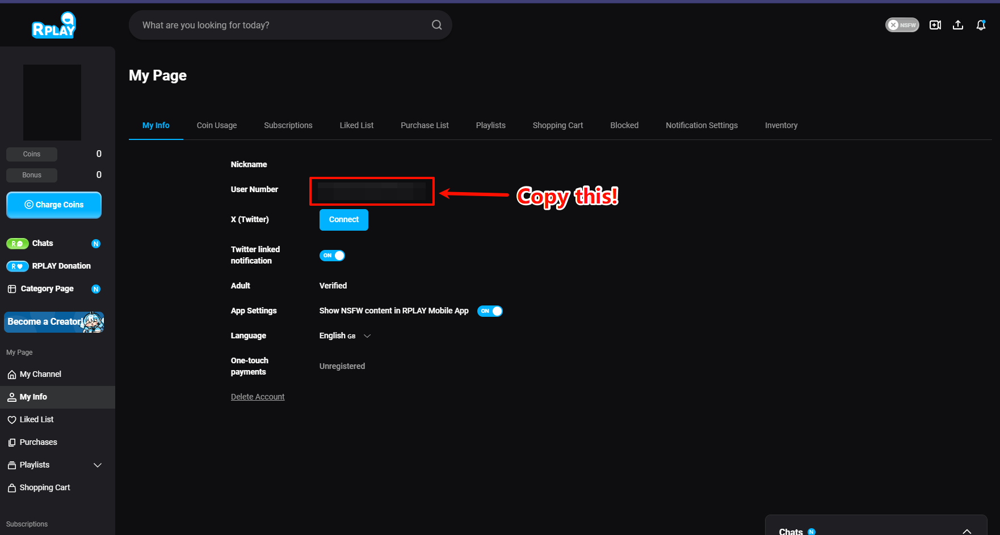
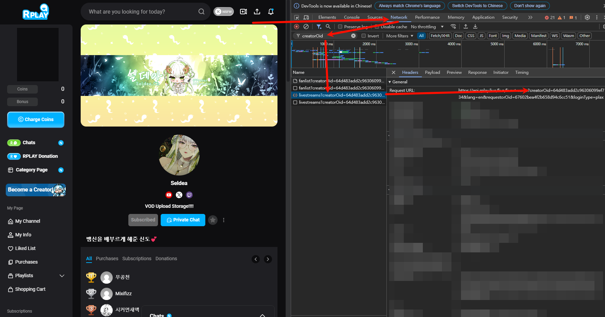

<p align="center">
    <h1 align="center">RPLAY-LIVE-DL</h1>
</p>
<p align="center">
    <em><code>❯ An automated RPlay live recorder designed for long-running Docker deployments.</code></em>
</p>
<p align="center">
    
    
    
    
</p>
<p align="center">Built with Docker, Python, Poetry, Pydantic, yt-dlp, and FFmpeg.</p>

---

## 📑 Table of Contents

- [📝 Description](#description)
- [⚠️ v2 Upgrade Notes](#v2-upgrade-notes)
- [✨ Features](#features)
- [🚀 Quick Start](#quick-start)
- [📘 Usage Guide](#usage-guide)
  - [System Requirements](#system-requirements)
  - [Obtaining Credentials](#obtaining-credentials)
  - [Configuration](#configuration)
  - [Download and Merge Flow](#download-and-merge-flow)
  - [Deployment](#deployment)
  - [Directory Structure](#directory-structure)
  - [Troubleshooting](#troubleshooting)
- [🛠️ Development](#development)
- [🔧 Project Structure](#project-structure)
- [👥 Contributing](#contributing)
- [📜 License](#license)

---

<a id="description"></a>

## 📝 Description

`rplay-live-dl` monitors a configured list of RPlay creators, starts recording automatically when a stream goes live, and stores finished recordings under `archive/<creator>/`. It is designed for long-running Docker deployments where configuration, archive files, and logs are mounted from the host.

> [!WARNING]
> **Vibe Coding Notice**: versions with the `-vibe` suffix (for example `2.0.0-vibe`) are AI-assisted releases. They pass automated tests, but you should still review breaking changes before upgrading production deployments.

---

<a id="v2-upgrade-notes"></a>

## ⚠️ v2 Upgrade Notes

`2.0.0-vibe` contains a breaking config-path change.

| Before v2 | Since `2.0.0-vibe` |
| --- | --- |
| `./config.yaml` | `./config/config.yaml` |
| mount one file | mount the whole `./config` directory |

Upgrade checklist:

1. Move your config file from `./config.yaml` to `./config/config.yaml`.
2. Update Docker volume mounts to use `./config:/app/config`.
3. Restart the container.

Startup protection:

- if `./config/config.yaml` is missing
- and legacy `./config.yaml` still exists
- the app exits early with a migration error instead of silently starting with the wrong mount layout

<a id="v25-upgrade-notes"></a>

## ⚠️ v2.5 Upgrade Notes

`2.5.0-vibe` removes `AUTH_TOKEN`. RPlay no longer accepts the old static JWT, so `REFRESH_TOKEN` is now the only credential.

Upgrade checklist:

1. Follow [Account credentials](#account-credentials) to copy a new `REFRESH_TOKEN`.
2. Set it in `.env` and remove `AUTH_TOKEN`.
3. Recreate the container with `docker compose up -d --force-recreate`.

---

<a id="features"></a>

## ✨ Features

- automated live monitoring for multiple creators
- session-aware download tracking to avoid creator-level blocking
- flat archive layout with timestamp-prefixed `.ts` files per session
- immediate merge queueing after raw download completion
- legacy-compatible final filenames such as `#Creator 2026-03-06 Title.mp4`
- duplicate title protection with suffixed outputs like `_1`, `_2`, and so on
- paid/private stream detection with blocked-session handling
- failed merge leaves raw `.ts` files in place for manual recovery
- fail-fast startup validation for legacy config path upgrades
- Docker-first deployment for long-running operation
- Docker `HEALTHCHECK` via a poll-cycle heartbeat file (`python -m core.health`)

---

<a id="quick-start"></a>

## 🚀 Quick Start

1. Create your environment file: copy `.env.example` to `.env`.
2. Create `config/config.yaml` from `config.yaml.example`.
3. Fill in your RPlay credentials, creator list, and optionally `apiBaseUrl`.
4. Optionally set `LOG_LEVEL=DEBUG` when you want verbose lifecycle logs.
5. Start the service with Docker Compose.
6. Watch logs until the first polling cycle succeeds.

```bash
# 1) Prepare config files
cp .env.example .env
mkdir -p config
cp config.yaml.example config/config.yaml

# 2) Start the service
docker compose up -d

# 3) Follow logs
docker compose logs -f
```

---

<a id="usage-guide"></a>

## 📘 Usage Guide

### System Requirements

Production:

- Docker
- valid RPlay account credentials
- stable network connectivity
- enough disk space for `.ts` recordings and final `.mp4` files

Development:

- Python 3.11+
- Poetry
- FFmpeg

### Obtaining Credentials

#### Account credentials

1. Open your logged-in session at `https://rplay.live`.
2. Visit `https://rplay.live/myinfo/` and copy **User Number** to `USER_OID` in `.env`.



3. Open browser DevTools (`F12`) → **Console**.
4. Paste this script and press Enter. If Chrome asks, type `allow pasting` first.

```js
const c = copy;
const open = indexedDB.open('rplay-account-session');
open.onsuccess = () => {
  const req = open.result.transaction('records').objectStore('records').get('session');
  req.onsuccess = () => {
    const token = req.result?.session?.refreshToken;
    token ? (c(token), console.log('✅ REFRESH_TOKEN copied to clipboard')) : console.log('❌ Not found. Make sure you are logged in.');
  };
};
```

5. When you see `✅ REFRESH_TOKEN copied to clipboard`, paste the value into `REFRESH_TOKEN` in `.env`. The `undefined` line printed afterwards is normal.

If the script reports `❌ Not found`, sign in again and retry. If the clipboard is not available, open **Application** → **IndexedDB** → `rplay-account-session` → `records` → `session`, expand `session`, and copy the `refreshToken` value by hand.

Use the same account for the token and `USER_OID`. Keep token values out of screenshots, logs, and issues.
Close the browser tab after copying. Do not sign out.

#### Creator ID

1. Visit the creator profile page
2. Open DevTools → Network
3. Refresh the page and search for `CreatorOid`
4. Copy the creator ID



### Configuration

#### Environment file

Copy `.env.example` to `.env`. Both local runs and the bundled `docker-compose.yaml` use `.env`.

Full example:

```dotenv
# Required: account credentials
USER_OID=your_user_oid
REFRESH_TOKEN=your_refresh_token
TOKEN_REFRESH_LEEWAY_SECONDS=300

# Optional: monitor poll interval in seconds (10-3600)
INTERVAL=60

MIN_FREE_DISK_GB=5

# Optional: application log level
LOG_LEVEL=INFO

# Optional: surface yt-dlp internal debug chatter
# truthy: 1/true/yes/on; falsy: 0/false/no/off/empty; other values abort startup
LOG_YTDLP_INTERNAL=false

# Optional: log rotation settings
LOG_MAX_SIZE_MB=5
LOG_BACKUP_COUNT=5
LOG_RETENTION_DAYS=30

# Optional: startup metadata shown as Git SHA in logs
# Usually injected automatically during Docker image builds
APP_GIT_SHA=
```

Environment variables:

| Variable | Required | Default | Validation / accepted values | Purpose |
| --- | --- | --- | --- | --- |
| `USER_OID` | yes | none | non-empty | Your RPlay user identifier |
| `REFRESH_TOKEN` | yes | none | non-empty | Acquires and renews access JWTs |
| `TOKEN_REFRESH_LEEWAY_SECONDS` | no | `300` | non-negative integer | Renew before key2 when JWT has fewer seconds remaining; `0` renews only when expired |
| `INTERVAL` | no | `60` | integer `10`-`3600` | Poll interval in seconds |
| `MIN_FREE_DISK_GB` | no | `5` | non-negative number; `0` disables the guard; invalid/negative values abort startup | Skip starting a new recording when free space on the output volume is below this many GiB |
| `LOG_LEVEL` | no | `INFO` | `DEBUG`, `INFO`, `WARNING`, `ERROR`, `CRITICAL`; invalid values abort startup with a non-zero exit | Console and file log verbosity |
| `LOG_YTDLP_INTERNAL` | no | `false` | truthy: `1`, `true`, `yes`, `on`; falsy: `0`, `false`, `no`, `off`, empty; other values abort startup | Enables noisy yt-dlp internal debug lines |
| `LOG_MAX_SIZE_MB` | no | `5` | integer `1`-`100` | Maximum size of each log file before rotation |
| `LOG_BACKUP_COUNT` | no | `5` | integer `1`-`50` | Number of rotated log files to keep |
| `LOG_RETENTION_DAYS` | no | `30` | integer `1`-`365` | Startup cleanup of log files older than this many days |
| `APP_GIT_SHA` | no | empty | free-form string | Startup version metadata shown in logs; usually injected by Docker/image builds |

Notes:

- local runs load from `.env` or process environment variables
- the bundled Docker Compose file loads `.env` through `env_file`, so its values become real container environment variables
- `LOG_YTDLP_INTERNAL=true` is only for deep diagnosis; it is intentionally noisy

`USER_OID` and `REFRESH_TOKEN` are both required. If `REFRESH_TOKEN` is missing, startup fails with a configuration error.

Startup obtains a JWT and validates key2 with `loginType=rplay`. Monitoring reuses that client. JWTs stay in memory.
Before another key2 request, the client refreshes if the JWT has expired or has fewer than the configured seconds remaining.
There is no periodic refresh timer, and refreshing does not restart an active recording.
See [authentication behavior and verification](docs/authentication.md) for protocol details and limitations.

#### Creator configuration

Copy `config.yaml.example` to `config/config.yaml` and edit it like this:

```yaml
# Optional. If missing, the app uses the default below without modifying this file.
apiBaseUrl: https://api.rplay.live

creators:
    - name: "Creator Nickname 1"
      id: "Creator OID 1"
    - name: "Creator Nickname 2"
      id: "Creator OID 2"
```

Configuration keys:

| Key | Required | Default | Validation | Purpose |
| --- | --- | --- | --- | --- |
| `apiBaseUrl` | no | `https://api.rplay.live` | absolute URL; surrounding whitespace is trimmed and trailing `/` is removed | Base URL for the RPlay API |
| `creators` | no | empty list | YAML list | Creators to monitor |
| `creators[].name` | yes | none | non-empty, max `100` characters | Display name used in logs, folder names, and final filenames |
| `creators[].id` | yes | none | non-empty | Creator OID from the RPlay profile/network requests |

Notes:

- if `apiBaseUrl` is missing, the app uses the default in memory and leaves `config/config.yaml` untouched
- the monitor re-reads `config/config.yaml` on every poll, so updating `apiBaseUrl` in a running Docker deployment does not require a container restart
- an invalid `apiBaseUrl` is treated as a config error and the current poll is skipped until the file is fixed
- you can temporarily leave `creators: []` while validating a deployment

### Disk capacity

Archive free space is checked at each poll, even when the upstream request fails.
`DISK_WARNING_GB=30` and `DISK_CRITICAL_GB=10` set the alert levels in GiB;
critical must be below warning. Alerts do not stop active recordings or delete files.
The existing `MIN_FREE_DISK_GB` gate still applies to new recordings.

Transitions are logged immediately, with reminders every `DISK_REMINDER_SECONDS=3600`.
Recovery requires `DISK_RECOVERY_MARGIN_GB=2` above the relevant threshold to avoid
flapping. Alert state is in memory and resets on restart. Checks run at the poll
cadence (`INTERVAL`), not continuously; a stalled poll delays the next check.

Both normal merges and startup recovery check free space before launching FFmpeg:
`sum(raw TS bytes) * MERGE_SPACE_MULTIPLIER + MERGE_MIN_FREE_DISK_GB * 1024^3`.
Defaults are `1.1` (minimum `1`) and a `1` GiB reserve. The multiplier budgets the
temporary MP4 that FFmpeg writes. The finished file is then installed with a
hardlink, which needs no extra space. On filesystems without hardlinks (exFAT,
some CIFS mounts) the file is copied instead; set `MERGE_SPACE_MULTIPLIER=2.2`
there. If a copy still runs out of space, the partial copy is removed and the raw
inputs are kept. This is an estimate, not a disk reservation: concurrent
recordings or other applications can still consume space during the merge.
An insufficient or unreadable space check skips that merge, logs one line with
the reason, and preserves the raw inputs. Free space and restart to retry startup
recovery; there is no automatic running merge retry. These environment settings
require container recreation.

### Discord notifications

Set `DISCORD_WEBHOOK_URL` in your local `.env` to a Discord **incoming webhook**
URL, then recreate the container (`docker compose up -d --force-recreate`).
Leave it empty to disable notifications. Keep this URL private: it authorizes
message sending. Never commit it or paste it into logs. Only HTTPS Discord webhook
URLs are accepted; URL query parameters (including thread targets) are not supported.

`DISCORD_WEBHOOK_EVENTS` is a comma-separated selection (all events below by
default); an empty value disables all events. Each notification is one English
Discord rich-embed card: a short title, status color, relevant fields, and a next
step when action is useful. Main event titles have no emoji except
`🔑 Authentication failed`; field headings use contextual icons. Each event has
a distinct side color: live is rose, ended streams are slate gray, restricted
access is amber, authentication failure is coral red, retries are blue, incomplete
merges are violet, completed merges are teal, low capacity is yellow, and
critical capacity is deep red.
No bot or extra credentials are required.

Creator and stream title appear when available; only live cards include the
stream start time. Valid
timezone-aware stream times use Discord's native timestamps, displayed in the
reader's timezone and locale. The creator appears in an author row with a small
avatar; a larger avatar thumbnail appears at the right. Main embed titles retain
the event name, such as `Live now`, `Stream ended`, or `Merge complete`, without
emoji (apart from the authentication exception). The actual stream title appears
in bold in the body under the bold `🎬 Stream title` label.
Only live and restricted-access cards link the main event title to the public
stream page. Stream-name text and creator names are not hyperlinks. Ended-stream, retry,
merge-failure, and merge-completion cards keep the avatars but no headline link.
Both live and ended-stream cards use the creator's avatar. Disk
cards stack emoji-labelled remaining free space above the current event's
configured warning or critical level in GiB, rather than placing them side by side.
Absent values are omitted, not shown
as zero. Some cards open their guidance with one short line of context: merges
skipped for lack of disk space, results of startup recovery, and authentication
failures found at startup (monitoring did not start). This context is fixed text;
cards never include raw error output. Cards omit unrelated threshold settings,
repeated status explanations, and footer timestamps. Errors include concise recovery guidance
directly in the body rather than a separate next-step field, with each sentence
on its own line (decimals and filenames stay intact). Merge-completion cards
include the saved filename, not the full local path. Live/ended cards
report stream state, not recording or merge completion. Disk alerts still use
the configured hysteresis; recovery does not restart skipped merges or prove
recordings are healthy. Active recordings are not stopped by disk alerts.

Avatar URLs use the public `pb3.rplay.live/profilePhoto/<creator ID>-small/`
route observed on RPlay's creator cards. Only validated 24-digit hexadecimal
creator IDs produce links; arbitrary image URLs and signed stream URLs are not
accepted. Discord fetches the public image without RPlay credentials. If identity
is unavailable (for example, old orphan recovery), the image is omitted. The
recorder does not fetch a profile for every poll or scrape browser login data.

Edit `_CARD_COPY` in `core/notifications.py` for English titles, descriptions,
colors, and actions; edit `format_discord_message` there for layout. Event data
lives in `models/notification.py`. Delivery, retries, and deduplication are unchanged.
Dynamic fields are redacted, Markdown-escaped, and truncated to embed field limits;
the bounded layout stays below Discord's 6,000-character aggregate limit. Mentions
remain disabled. Authenticated URLs are never included; `SUPPRESS_EMBEDS` is not
set, so it does not hide the cards.

| Event | Trigger |
| --- | --- |
| `live` | A monitored RPlay stream is first observed, including already-live streams at startup; not proof recording started |
| `offline` | A previously observed RPlay stream is absent from two successful status polls, or is replaced by a new stream start time; not proof recording/merge completed |
| `blocked` | Download access is denied under the existing 403/404 retry policy; possibly paid/private, not a confirmed paid classification |
| `auth_failed` | Startup or runtime RPlay credentials are rejected |
| `download_failed` | Repeated raw download failures enter the existing retry cooldown |
| `merge_failed` | Normal merge or startup recovery fails, including insufficient merge space; raw inputs retained |
| `merge_completed` | Normal merge or startup recovery installs a validated, nonempty MP4; includes its filename |
| `disk_warning` | Archive space enters warning level, de-escalates from critical, or reminder is due |
| `disk_critical` | Archive space enters critical level or reminder is due |

Disk recovery still clears the internal alert state and is logged, but sends no
webhook. The retired `disk_recovered` event is ignored in older configurations.
If you explicitly set `DISCORD_WEBHOOK_EVENTS`, add `merge_completed` to receive
completion notices; otherwise it is enabled by default.

For capacity alerts only:

```dotenv
DISCORD_WEBHOOK_EVENTS=disk_warning,disk_critical
```

Live detection is deduplicated by creator and stream start time, independent of
title changes. Ended-stream notices retain the last observed title and identity.
An API failure does not count as an offline poll; removing a creator from the
monitor list does not send an ended notice. Detection is polling-based, not an
exact end timestamp. A new start time closes the prior stream before its new
live notice. This changes notifications only, not the recording shutdown policy.
If you already set `DISCORD_WEBHOOK_EVENTS`, add `offline` to enable ended notices
and recreate the container; existing environment files are not edited automatically.
Other errors are deduplicated when queued (one hour per event/key);
disk reminders follow `DISK_REMINDER_SECONDS` instead. All state is in memory and
resets on restart. Startup can therefore notify again about ongoing streams.

Delivery uses one background worker and a bounded 100-message queue, never HTTP
on the recording thread. HTTP 429 waits for Discord's retry delay; connection
errors and HTTP 5xx have at most three attempts total. HTTP 401/403/404 disables
the webhook until restart. Other rejected messages are not retried. Update an
invalid URL in `.env` and recreate the container. Queue overflow, delivery failure,
and shutdown drops are logged without the webhook URL or response body.

Notifications are best-effort, not durable: queue overflow or shutdown after the
five-second drain deadline can lose messages, and a network timeout can produce
a duplicate on retry. Failure details remain in local logs; messages include safe
operator guidance instead of raw upstream errors, credentials, or stream URLs.

#### Preview notification cards

From the project root, run this manual tester to send eight simulated cards to
the channel associated with `DISCORD_WEBHOOK_URL`:

```powershell
.\.venv\Scripts\python.exe scripts/test_discord_cards.py
```

Or use `poetry run python scripts/test_discord_cards.py`. The script reads the
project-root `.env`; an environment variable takes precedence. No RPlay account
credentials are required. It deliberately ignores `DISCORD_WEBHOOK_EVENTS` so
you can preview all eight types: live, restricted access, authentication
failure, delayed retries, merge failure, merge completion, low space, and critical space.

Cards use the production layout without test labels or sequence numbers.
These are simulated notifications, not real events; use a suitable preview channel.
Stream cards use a sample creator's public
avatar with a realistic fictional stream title; times and disk values are
simulated. Account authentication errors carry no creator or stream identity.
No recording is started and
no files are merged or removed. Each run sends another set of messages.

- Add `--include-offline` to also preview stream ended (nine cards total).
- Add `--dry-run` to print the payloads without reading credentials or sending.
- The script reports confirmed HTTP deliveries, reuses the application's retry
  and rate-limit handling, and stops with a nonzero exit code on failure. A network
  timeout can still cause a duplicate; check the channel before rerunning.

### Recording metadata

New normal merges store the original (unsanitized) `title`, creator display name
(`artist`), `rplay_creator_oid`, `rplay_stream_oid`, `rplay_stream_start_time`,
and `rplay_recording_started_at` in the MP4 itself. Times use UTC ISO 8601, and
`rplay_metadata_version=1` identifies the tag schema. This happens during the
existing stream-copy merge, without a second encode, database, or sidecar index.
The creator name follows your creator configuration; IDs come from the session.
Credentials and authenticated stream URLs are never included.

Startup recovery cannot reconstruct the original IDs or unsanitized title from
old fragments. It writes only `rplay_metadata_version`, `rplay_recovered=true`,
and `rplay_source_filename`; unknown values are omitted rather than guessed.
Existing MP4s are not rewritten. Some players do not display custom MP4 tags;
inspect them with `ffprobe -v error -show_entries format_tags -of json video.mp4`.

### Download and Merge Flow

The v2 runtime uses a session-aware download pipeline.

1. **Poll**
   - the monitor loads `config/config.yaml`
   - it refreshes `apiBaseUrl` from config before calling the API
   - it checks live status for all configured creators

2. **Create a session**
   - each live stream gets a session key based on `creator_oid` and the local recording start time (`recording_started_at`), not the API stream `oid`
   - a timestamp prefix (`YYYYMMDD_HHMMSS_`) is derived from `recording_started_at` in machine local time
   - raw files are written directly to `archive/<creator>/` using this prefix for isolation

3. **Download raw transport stream files**
   - yt-dlp writes raw outputs as `.ts` directly into `archive/<creator>/`
   - each download task uses a `10`-second socket timeout
   - transient task failures automatically retry up to `3` attempts total with exponential backoff
   - after a raw task failure, the monitor permits one immediate recovery poll per creator; repeated failures are throttled with a per-creator cooldown (30 seconds, doubling to a 5-minute cap) so a no-output failure cannot create a hot retry loop
   - `HTTP 404` on the stream playlist is retried with exponential backoff before the session is marked blocked
   - `HTTP 403` is still treated as immediate blocked/private access
   - `HTTP 401` is treated as an authentication failure instead of a blocked session
   - raw filenames carry the session timestamp prefix, for example:
     - `20260306_120000_#Creator 2026-03-06 Title.ts`
     - `20260306_120000_#Creator 2026-03-06 Title_1.ts`

4. **Queue merge immediately after download completes**
   - as soon as raw download finishes, the merge job is submitted to the merge executor
   - the control loop can move on quickly, so a new live session from the same creator can be picked up without waiting for the old merge to finish

5. **Merge into final `.mp4`**
   - all `.ts` files in `archive/<creator>/` matching the session prefix are merged into one final `.mp4`
   - even if only one raw `.ts` file exists, the final visible output is still `.mp4`
   - FFmpeg writes to a same-directory temporary `.merging.mp4`; only a completed, non-empty file is installed under the visible name
   - final installation never overwrites an existing recording: a name claimed while FFmpeg is running is retried with the next numeric suffix

6. **Clean up or preserve for recovery**
   - on success, the `.ts` files matching the session prefix are deleted from `archive/<creator>/`
   - on merge failure, the `.ts` files remain in `archive/<creator>/` for manual inspection and recovery
   - live and startup recovery installs the validated merge with a no-overwrite hardlink when the filesystem supports it; on exFAT/CIFS-style filesystems it reserves the first free name with `O_EXCL` and stream-copies instead
   - if that fallback copy fails, the new destination is removed when possible and the raw `.ts` files remain; a process killed during the copy may leave a partial claimed `.mp4`, so the next recovery attempt keeps that name untouched, uses the next free suffix, and leaves the stale file for manual inspection

7. **Observe lifecycle logs**
   - set `LOG_LEVEL=DEBUG` in `.env` to see stream-candidate evaluation and skip reasons
   - set `LOG_YTDLP_INTERNAL=true` only when you need raw yt-dlp internal chatter in addition to app logs
   - the default `INFO` level keeps routine output readable for long-running Docker deployments
   - unchanged polls do not emit periodic heartbeat messages; use the heartbeat healthcheck for liveness, while recording status changes remain logged
   - application console and file output mask configured credentials, common token fields, authorization headers, JWTs and Discord webhook tokens, including tracebacks; review logs before sharing because this is not a general personal-data filter
   - failed FFmpeg merges report the exit code or timeout and a redacted stderr tail (last 10 lines, at most 2,000 characters plus a truncation marker); expected FFmpeg failures do not add a redundant Python traceback, while unexpected exceptions still do

#### Final filename rules

Visible final outputs use a clean naming style:

- first session: `#Creator 2026-03-06 Title.mp4`
- second session on the same day with the same title: `#Creator 2026-03-06 Title_1.mp4`
- later duplicates continue as `_2`, `_3`, and so on

Raw `.ts` files carry a timestamp prefix for session isolation:

- `20260306_120000_#Creator 2026-03-06 Title.ts`
- prefix format is `YYYYMMDD_HHMMSS_` in machine local time
- prefix uniquely identifies the recording session; files from different sessions never collide

### Deployment

#### Docker Compose (recommended)

```bash
# Start recording
docker compose up -d

# View logs
docker compose logs -f

# Stop recording
docker compose down

# Update image and restart
docker compose pull
docker compose up -d
```

The bundled `docker-compose.yaml` reads `./.env` via `env_file`, and mounts:

- `./config` → `/app/config`
- `./archive` → `/app/archive`
- `./logs` → `/app/logs`

#### Docker directly

```bash
docker run -d \
  --env-file .env \
  -v $(pwd)/config:/app/config \
  -v $(pwd)/archive:/app/archive \
  -v $(pwd)/logs:/app/logs \
  paverz/rplay-live-dl:latest
```

#### Docker healthcheck

The image runs `python -m core.health` every 60s (`--retries=3`). Healthy when `/tmp/rplay-live-dl-heartbeat` exists and its mtime is strictly fresher than `3 × INTERVAL` seconds (touched once per monitor poll cycle, including failed ones). Docker only *displays* unhealthy status; it does not restart the container. With default `INTERVAL=60`, probes start failing after 180s without a heartbeat update, and Docker marks the container unhealthy ~300–360s after the last heartbeat update.

### Directory Structure

Typical runtime layout:

```text
rplay-live-dl/
├── archive/
│   └── Creator/
│       ├── #Creator 2026-03-06 Title.mp4
│       ├── #Creator 2026-03-06 Title_1.mp4
│       ├── 20260306_120000_#Creator 2026-03-06 Title.ts    ← active or failed session
│       └── 20260306_130000_#Creator 2026-03-06 Title.ts    ← active or failed session
├── config/
│   ├── .gitkeep
│   └── config.yaml
├── .env                 # credentials and runtime settings
├── logs/
└── docker-compose.yaml
```

Notes:

- `.ts` files with a timestamp prefix are either active downloads or unmerged fragments from a failed session
- on successful merge the matching `.ts` files are deleted automatically
- on merge failure the `.ts` files remain in place for manual inspection and recovery
- final user-facing recordings live directly under `archive/<creator>/`

### Troubleshooting

#### 1. Startup fails after upgrading to v2

Symptom:

- the app exits with a config migration error

Cause:

- `./config.yaml` still exists, but `./config/config.yaml` does not

Fix:

- move `./config.yaml` to `./config/config.yaml`
- update Docker to mount `./config:/app/config`

#### 2. Stream is not recording

Check:

- the configured `REFRESH_TOKEN` is still valid
- `USER_OID` is correct
- creator ID is correct
- there is enough free disk space
- logs do not show API or connection failures

#### 3. Stream access fails (`401` / `403` / `404`)

Behavior:

- `401` indicates an authentication failure; check the configured credential and `USER_OID`
- `403` is treated as immediate blocked/private/paid access
- `404` can appear for a few seconds right after stream start; the downloader retries automatically before marking the current session blocked
- timeout-like transport errors also retry automatically within the same download task
- after retries are exhausted, the current session is marked blocked or failed according to the final error
- a later new session from that creator can still be retried normally

Check:

- if token refresh is rejected (`401` / `403`), sign in to the website, copy the current `REFRESH_TOKEN`, verify `USER_OID`, and recreate the container with `docker compose up -d --force-recreate` (or restart the local process)
- if startup says `AUTH_TOKEN is no longer supported`, follow the [v2.5 upgrade notes](#v25-upgrade-notes)
- if repeated `403` persists, confirm the stream is not paid/private for your account
- if repeated `404` persists after the automatic retries, wait a few seconds and confirm the stream actually remained live

Refresh request rejection is an account credential error, separate from a playlist's paid/private access failure. Transient refresh failures (timeouts, connection errors, or HTTP `429`, `500`, `502`, `503`, `504`) retry up to three attempts. An invalid refresh response is reported explicitly. Refresh-token lifetime, revocation, and rotation rules are unverified; automatic JWT renewal does not guarantee indefinite unattended operation. If the service starts rotating refresh tokens, obtain the current value from the browser and update the configuration.

#### 4. Merge failed

Behavior:

- the `.ts` files matching the failed session prefix remain in `archive/<creator>/`
- the app does not silently delete the session fragments

Check:

- FFmpeg availability in the runtime image
- file-system permissions
- available disk space
- the preserved raw `.ts` files in `archive/<creator>/` for manual recovery

#### 5. Shutdown takes time

Behavior:

- graceful shutdown may wait for active merge work to finish
- this is expected for a long-running recorder that prioritizes keeping completed raw work recoverable

---

<a id="development"></a>

## 🛠️ Development

Install dependencies:

```bash
poetry install --with dev
```

Run locally:

```bash
poetry run python main.py
```

Run tests:

```bash
poetry run pytest
```

Run tests with coverage:

```bash
poetry run pytest --cov --cov-report=xml
```

---

<a id="project-structure"></a>

## 🔧 Project Structure

```text
rplay-live-dl/
├── .github/
│   └── workflows/
│       ├── docker-smoke.yml
│       ├── main.yaml
│       └── test.yml
├── core/
│   ├── config.py
│   ├── constants.py
│   ├── download_merge_executor.py
│   ├── downloader.py
│   ├── env.py
│   ├── health.py
│   ├── live_stream_monitor.py
│   ├── logger.py
│   ├── rplay.py
│   ├── scheduler.py
│   └── utils.py
├── models/
│   ├── config.py
│   ├── download.py
│   ├── env.py
│   └── rplay.py
├── tests/
│   ├── __init__.py
│   ├── conftest.py
│   ├── test_config.py
│   ├── test_download_merge_executor.py
│   ├── test_download_models.py
│   ├── test_downloader.py
│   ├── test_env.py
│   ├── test_health.py
│   ├── test_live_stream_monitor.py
│   ├── test_logger.py
│   ├── test_main.py
│   ├── test_merge_flow.py
│   ├── test_models.py
│   ├── test_monitor_events.py
│   ├── test_rplay.py
│   ├── test_scheduler.py
│   └── test_utils.py
├── images/
│   ├── creator_oid.png
│   └── user_oid.png
├── config/
│   └── .gitkeep
├── .dockerignore
├── .env.example
├── .gitignore
├── LICENSE
├── config.yaml.example
├── docker-compose.yaml
├── Dockerfile
├── main.py
├── poetry.lock
├── pyproject.toml
└── README.md
```

---

<a id="contributing"></a>

## 👥 Contributing

- **💬 [Join the Discussions](https://github.com/Zhen-Bo/rplay-live-dl/discussions)**: Share ideas, ask questions, or discuss operational trade-offs.
- **🐛 [Report Issues](https://github.com/Zhen-Bo/rplay-live-dl/issues)**: Submit bugs, regressions, or feature requests.
- **💡 [Submit Pull Requests](https://github.com/Zhen-Bo/rplay-live-dl/pulls)**: Review open PRs and contribute improvements.

<details closed>
<summary>Contribution Workflow</summary>

1. **Fork the repository** to your own GitHub account.
2. **Clone locally**:
   ```bash
   git clone https://github.com/Zhen-Bo/rplay-live-dl
   ```
3. **Create a focused branch**:
   ```bash
   git checkout -b your-change
   ```
4. **Make your changes** and keep the scope tight.
5. **Run the relevant verification** before opening a PR:
   ```bash
   poetry run pytest
   ```
6. **Commit with a clear message** using Conventional Commit style when possible.
7. **Push your branch** and open a pull request.
8. **Describe the change clearly** with test evidence and any config or operational impact.

PR checklist:

1. Follows the existing project style and naming conventions.
2. Uses Conventional Commit style for commit messages when practical.
3. Includes tests for behavior changes, or clearly explains why tests were not needed.
4. Updates documentation and example config files when user-facing behavior changes.
5. Calls out any breaking change, migration step, or deployment impact.
</details>

### Contributor Graph

<p align="left">
   <a href="https://github.com/Zhen-Bo/rplay-live-dl/graphs/contributors">
      
   </a>
</p>

---

<a id="license"></a>

## 📜 License

This project is licensed under the MIT License. See [LICENSE](LICENSE) for details.
